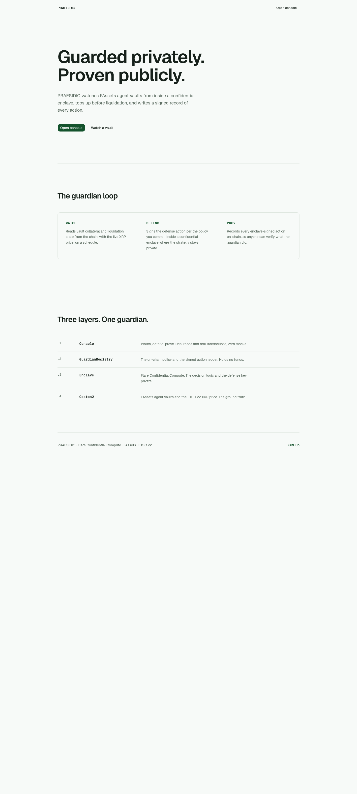
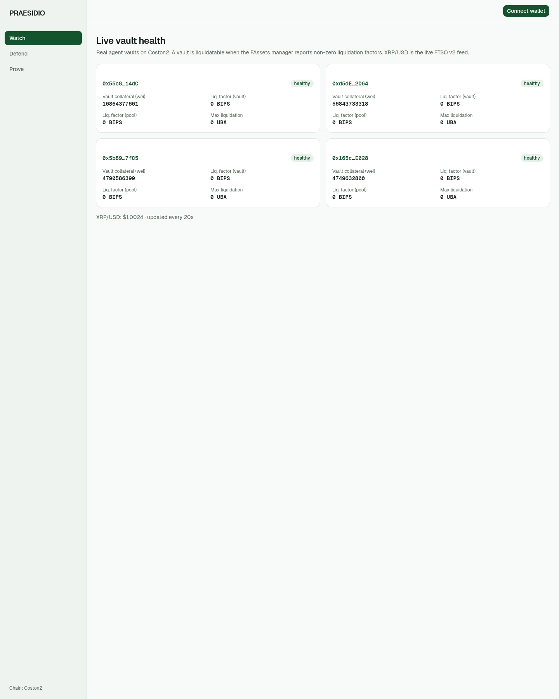

<div align="center">



&nbsp;

# Praesidio

**A confidential guardian for FAssets agent vaults.**

Praesidio watches an FAssets agent's vault collateralization from inside a
trusted execution environment, decides when a top-up is needed, signs the
action with the guard key, and writes every decision to an on-chain audit
ledger that anyone can verify. The strategy runs private; the record is public.


### ▶ Live at https://praesidio-nu.vercel.app

[Live demo ↗](https://praesidio-nu.vercel.app) · [Repo ↗](https://github.com/subheeksh5599/praesidio) · [How it works ↓](#how-praesidio-works) · [Run it locally ↓](#run-it-locally)

Built for the Flare Summer Signal hackathon. MIT licensed.

</div>

## Table of contents

- [▶ See it in one command](#-see-it-in-one-command)
- [The problem Praesidio solves](#the-problem-praesidio-solves)
- [How Praesidio works](#how-praesidio-works)
  - [1 · Read](#1--read)
  - [2 · Decide](#2--decide)
  - [3 · Sign](#3--sign)
  - [4 · Post](#4--post)
  - [5 · Prove](#5--prove)
- [Architecture](#architecture)
- [Engineering decisions — the hard problems](#engineering-decisions--the-hard-problems)
- [What's real vs pending — the honesty table](#whats-real-vs-pending--the-honesty-table)
- [Tests](#tests)
- [Run it locally](#run-it-locally)
- [Configuration](#configuration)
- [Deploy](#deploy)
- [Project layout](#project-layout)
- [Tech stack](#tech-stack)
- [Roadmap](#roadmap)
- [License](#license)

## ▶ See it in one command

```bash
# GuardianRegistry: 18/18 tests, including revert paths
forge test

Suite result: ok. 18 passed; 0 failed; 0 skipped
Ran 1 test suite in 18.46ms (6.87ms CPU time): 18 tests passed, 0 failed, 0 skipped (18 total tests)
```

```bash
# The exact live signal the guardian reads on Coston2 — FTSO v2 XRP/USD
cast call --rpc-url https://coston2-api.flare.network/ext/C/rpc \
  0xC4e9c78EA53db782E28f28Fdf80BaF59336B304d \
  "getFeedById(bytes21)(uint256,int8,uint64)" \
  0x015852502f55534400000000000000000000000000

1010400 [1.01e6]   # XRP/USD, 6 decimals = $1.0104
6
1786677694 [1.786e9]
```

The console, live — WATCH tab reading real Coston2 vaults (no mocks):



## The problem Praesidio solves

- FAssets agents must hold more XRP collateral than the FXRP they issued. If
  the ratio drops, anyone can seize their collateral in a graduated
  liquidation. Agents lose real money when they miss a drop.
- Today agents watch their vaults by hand, hoping they never miss a
  collateralization dip. There is no product doing this job continuously.
- A vault's strategy and health are private, but every defense action should
  be provable to the people who put up the collateral.
- Collateral providers cannot tell whether an agent's operations were sound —
  there is no attestable record of what an agent did and when.

Existing tools work after the fact: liquidation dashboards and notifiers tell
you what already happened. Praesidio works before: it checks the danger signal
on-chain, inside a private execution environment, and acts or alerts before
the liquidation race starts — with a signed on-chain record of every action.

## How Praesidio works

### 1 · Read

The guardian reads the vault's real state from the chain — collateral, owner,
and the liquidation factors (non-zero means liquidatable), plus the live
FTSO v2 price. This is the same read path the frontend console uses:

```solidity
// contracts/src/interfaces/IAssetManager.sol (Coston2 AssetManager diamond)
function getAgentLiquidationFactorsAndMaxAmount(
    address _agentVault,
    address _collateralType,
    address _priceType
) external view returns (uint256, uint256, uint256);
```

### 2 · Decide

Inside the Flare Confidential Compute extension, the `CHECK_VAULT` guard
compares the liquidation factors and collateralization ratio against the
vault's policy thresholds. The decision — `TOP_UP_REQUIRED` or `WATCH` — is
computed inside the guard; in the real-enclave path nobody outside the enclave
sees the policy.

### 3 · Sign

When a top-up is required, the guard signs the action digest with its
`GUARDIAN_KEY`:

```
keccak256(abi.encodePacked(chainId, guardId, actionType, amountWei, nonce))
```

The signer address is included in every signed action, so the on-chain
registry can verify the guard's identity without trusting any relay.

### 4 · Post

The relayer submits the signed action to the registry. The contract checks:
signer is the registered guardian signer, nonce is fresh (replay-protected),
signature is low-s (malleability-guarded). Then it writes the audit row.

```solidity
// contracts/src/GuardianRegistry.sol
function postAction(
    uint256 _guardId,
    ActionType _actionType,
    uint256 _amountWei,
    uint256 _nonce,
    bytes calldata _signature
) external;
```

### 5 · Prove

Anyone can read the full audit ledger for a guard — what was decided, when,
by which signer, and the signature proving it:

```solidity
function getActions(uint256 _guardId) external view returns (Action[] memory);
```

## Architecture

```
                    ┌──────────────────────────┐
                    │   Flare Confidential     │
  Coston2           │   Compute (TEE)          │
  ┌───────────┐     │  ┌──────────────────┐    │
  │ AssetMgr  │◄────┼──┤ CHECK_VAULT      │    │
  │ diamond   │     │  │ guard (Go)       │    │
  │ (vaults)  │     │  │ policy gating    │    │
  └───────────┘     │  │ GUARDIAN_KEY     │    │
  ┌───────────┐     │  └────────┬─────────┘    │
  │ FTSO v2   │◄────┼──┘ price  │ signed       │
  │ XRP/USD   │     │           │ action       │
  └───────────┘     └───────────┼──────────────┘
                                ▼
  ┌──────────────────────────────────────────┐
  │ GuardianRegistry (Coston2)                │
  │  registerAgentVault · setPolicy ·         │
  │  postAction (signer+nonce+low-s checks)   │
  │  AuditLedger · getActions                 │
  └───────────────┬──────────────────────────┘
                  │ events / reads
                  ▼
  ┌──────────────────────────────────────────┐
  │ Console (Next.js)                         │
  │  WATCH  — live vault health              │
  │  DEFEND — register / activate / pause    │
  │  PROVE  — audit ledger from the chain    │
  └──────────────────────────────────────────┘
```

### Component by component

| Component | Technology | Responsibility |
|---|---|---|
| GuardianRegistry | Solidity / Foundry | Vault registration, policy storage, signer registry, signed action ledger |
| TEE guard | Go (FCC extension scaffold) | Private vault-health check, policy gating, guard signing |
| Monitor | Node / viem | Live chain reads — collateral, factors, price |
| Relayer | Node / viem | Submits guard-signed actions to the registry |
| Console | Next.js / viem | WATCH / DEFEND / PROVE — real transactions, zero mocks |

## Engineering decisions — the hard problems

1. **The danger signal is liquidation factors, not price alone.** A vault can
   be nominally collateralized yet still liquidatable for one collateral type.
   The guard reads `getAgentLiquidationFactorsAndMaxAmount` — non-zero factors
   are the true "act now" signal. Price (FTSO v2) adds context for the policy.
2. **The FAssets entry point is not what the docs name it.** The registry's
   documented names do not resolve the system; the verified path is
   `fAsset.assetManager()` → the AssetManager diamond. All contract reads go
   through the real access path (see `docs/addresses.md`).
3. **Replay and malleability on the action ledger.** Every action binds
   `chainId · guardId · type · amount · nonce` into the digest, nonces are
   per-guard and monotonic, and signatures are rejected unless low-s. A
   captured transaction can never be replayed into a different ledger row.
4. **No hardcoded deployment values.** Contract addresses, the guardian signer
   and RPCs come from env; only protocol constants are defaulted. The deploy
   script resolves the AssetManager at runtime from the fAsset address.
5. **Key custody inside the guard.** The signing key lives with the guard; the
   on-chain registry stores only the derived signer address. Anyone can verify
   an action was guard-signed without the key ever appearing on-chain. (In the
   real-enclave path, the key is generated and held inside the TEE — see
   "Why simulated attestation" above.)

## What's real vs pending — the honesty table

| Feature | Status | Detail |
|---|---|---|
| GuardianRegistry (register, policy, signer, action ledger) | ✅ Real | `contracts/src/GuardianRegistry.sol`, 18/18 tests green |
| Replay / low-s malleability / signer-only posting guards | ✅ Real | tested revert paths |
| Registry deployed on Coston2 | ✅ Real | `0xc657e198…`, owner + guard signer set, verified on-chain |
| TEE guard extension (Go) | ✅ Real | builds + tests green; `CHECK_VAULT` reads real chain signals live |
| Guardian service (loop + TEE wiring + nonce safety) | ✅ Real | `backend/service.mjs`; reads guards, calls the TEE, relays signed actions |
| Backend monitor — live Coston2 reads | ✅ Real | verified: vault `0x55c815…`, 16,864,377,661 wei collateral, XRP/USD live |
| Web console (Watch / Defend / Prove, own URLs) | ✅ Real | `next build` green; real reads, real wallet txns, zero mocks |
| Digest/signature correctness (signer vs relayer) | ✅ Real | Go + Node produce the same digest, cross-language tested |
| Live signed action on-chain | ⚠️ Pending | needs a registered guard — i.e. an agent vault you own (see below) |
| Web console deployed (Vercel) | ✅ Real | https://praesidio-nu.vercel.app — live reads, zero mocks |
| TEE execution mode | ⚠️ Simulated | extension REGISTERED on FlareTeeManager (ID `0x…102c6`); runs with simulated testnet attestation (`SIMULATED_TEE=true`, Flare's documented Coston2 path) — see "Why simulated attestation" below |

The one thing that cannot be built from a laptop is a registered guard: the
registry only accepts a vault whose owner is the caller (verified against the
AssetManager), and creating an agent vault requires the FAssets agent-creation
flow (FDC AddressValidity attestation + collateral deposit). Everything up to
that boundary is built, tested and live.

### Why simulated attestation

The extension is a real, registered Flare Confidential Compute extension — the
`InstructionSender` is deployed and the extension is registered on the
FlareTeeManager (ID `0x…102c6`). The TEE machine itself, however, runs with
**simulated** attestation (`SIMULATED_TEE=true`, `TEST_PLATFORM`) rather than
real hardware attestation. That is deliberate, and it is exactly what Flare's
own "Build Your First Extension" guide prescribes for Coston2:

- Flare Confidential Compute is "in the final stages of development and not yet
  a fully public production system," so real hardware attestation is a
  production concern, not a testnet one.
- Flare's Coston2 guide runs "a local simulated TEE against the live Coston2
  chain," with `SIMULATED_TEE=true` described as "use a simulated code
  hash/platform so you can develop without Confidential VM hardware."

What the simulated path still proves: the full FCC loop — a registered
extension, an FTDC-attested TEE machine, instructions relayed by data
providers, and results signed with a boot-generated TEE identity key that are
verifiable on-chain.

What it deliberately does not prove: hardware isolation. Real attestation means
a measured `GCP_AMD_SEV` code hash from a GCP Confidential Space VM built with
`MODE=0`. That is the production path and the one remaining step for a
mainnet-grade confidentiality proof. Until then the guard's signing key is
injected from env, and this README labels that honestly.

## Tests

```bash
cd contracts && forge test

[PASS] testPostActionRevertsReplay() (gas: 222110)
[PASS] testPostActionRevertsUnknownGuard() (gas: 17546)
[PASS] testRegisterAgentVault() (gas: 161368)
[PASS] testRegisterRevertsDuplicate() (gas: 160113)
[PASS] testRegisterRevertsWhenNotVaultOwner() (gas: 21470)
[PASS] testRegisterRevertsZeroThreshold() (gas: 23566)
[PASS] testSetPausedOnlyOwner() (gas: 13427)
[PASS] testSetPolicy() (gas: 164254)
[PASS] testSetPolicyRevertsNonOwner() (gas: 159222)
[PASS] testSetPolicyRevertsUnknownGuard() (gas: 16037)
[PASS] testSetSignerOnlyOwner() (gas: 13397)
[PASS] testSetSignerZeroAddress() (gas: 11136)
Suite result: ok. 18 passed; 0 failed; 0 skipped
```

## Run it locally

```bash
git clone https://github.com/subheeksh5599/praesidio
cd praesidio

# Contracts
cd contracts
forge build
forge test

# TEE guard
cd ../tee/go
go build ./...      # + go test ./...

# Guardian service + TEE (the live loop — see docs/LIVE_E2E.md)
cd ../../backend
npm install
cp .env.example .env   # fill with Coston2 values
node monitor.mjs       # one-shot real read

# Web console
cd ../web
npm install
cp .env.example .env.local
npm run dev
```

## Configuration

| Variable | Default | Description |
|---|---|---|
| `COSTON2_RPC_URL` | `https://coston2-api.flare.network/ext/C/rpc` | Coston2 JSON-RPC |
| `FASSET` | testnet FXRP `0x0b6A36…` | fAsset token; AssetManager resolved via `assetManager()` |
| `ASSET_MANAGER` | resolved at runtime | AssetManager diamond (`0xc1Ca88b9…`) |
| `FTSO_V2` | `0xC4e9c78E…` | FTSO v2 feed contract |
| `GUARDIAN_REGISTRY` | `0xc657e198…` | deployed registry (Coston2) |
| `GUARDIAN_SIGNER` | — | guard signer address registered on-chain |
| `GUARDIAN_KEY` | — | guard signing key (TEE env only) |
| `RELAYER_PK` | — | relayer private key (gas payer) |

## Deploy

```bash
cd contracts
GUARDIAN_SIGNER=0x… FASSET=0x0b6A3645c240605887a5532109323A3E12273dc7 \
  forge script script/Deploy.s.sol --rpc-url $COSTON2_RPC_URL \
  --private-key $DEPLOYER_PK --broadcast
```

The deploy script resolves the AssetManager at runtime and records the
registry address for the relayer, console and docs. Contracts are configured
solc 0.8.28, via_ir, optimizer 200 (cancun) — the settings the explorer
verification flow passes automatically.

Live on Coston2: `GuardianRegistry 0xc657e19857630e74d1ea468c141d89ce8459c44e`
(deploy tx `0x38bf3270…`, guard signer `0x095b2B51…`, verified on-chain —
see `docs/addresses.md`).

## Project layout

```
praesidio/
├── contracts/     # GuardianRegistry + IAssetManager (Solidity, Foundry)
│   ├── src/
│   ├── test/
│   └── script/    # env-only deploy
├── tee/           # Flare Confidential Compute extension (Go)
│   ├── contracts/
│   ├── docker/
│   └── docs/
├── backend/       # guardian service + monitor + relayer (Node, viem)
├── web/           # console: WATCH / DEFEND / PROVE (Next.js)
├── docs/          # addresses.md — verified Coston2 reads + deployments
└── CHECKLIST.md   # build checklist, ticked with evidence
```

## Tech stack

| Layer | Technology |
|---|---|
| Contracts | Solidity 0.8.28, Foundry (forge, cast) |
| Confidential compute | Flare Confidential Compute extension scaffold, Go |
| Backend | Node.js, viem |
| Frontend | Next.js, TypeScript, viem |
| Chain reads | FAssets v1.3 (AssetManager), FDC, FTSO v2, Coston2 |

## Roadmap

- Deploy GuardianRegistry on Coston2 and run the full live loop: register a
  real vault, TEE check, signed top-up action, on-chain audit record.
- Run the TEE stack (extension-tee + ext-proxy) against Coston2 with simulated
  attestation — needs Flare's Coston2 indexer read-only credentials; then
  `post-build.sh` registers the TEE machine (Flare's documented Coston2 path).
- For a mainnet-grade confidentiality proof: build `MODE=0` and run in a real
  GCP Confidential Space VM (AMD SEV) with `GCP_AMD_SEV` attestation.
- Deploy the console and connect PROVE to live ledger rows.
- FAssets v2 (FBTC / FDOGE) — the same guardian ports to the new agent market.
- Redemption leg: signed actions for redemption management, not just top-ups.

## License

MIT. Built for the Flare Summer Signal hackathon.
